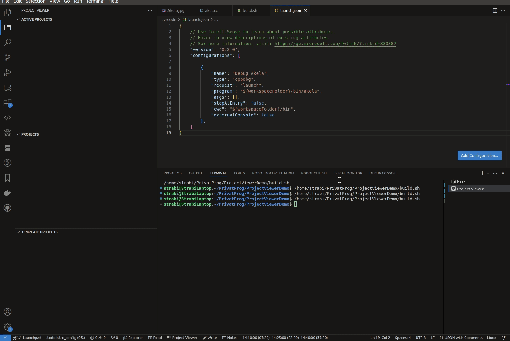
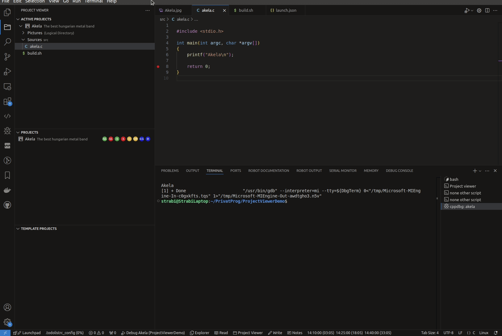

## Project Viewer extension from Visual Studio Code

The purpose of the extension is to facilitate easy navigation for projects built over large codebases.
The extension can logicaly partition the libraries and files into multiple separate logical projects and logical libraries, so we only see the necessary resources for the current working project.

It supports debugging and running scripts at the press of a buttons.

## Create, build and debug project

## Modify project

